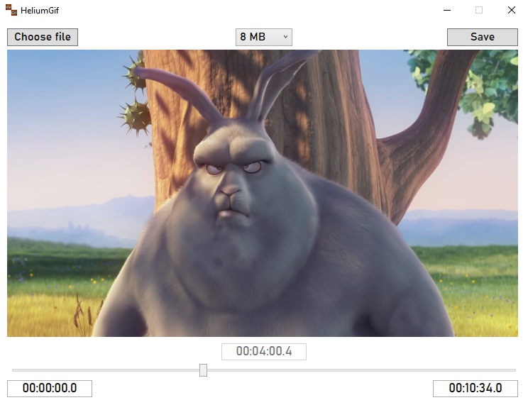

# HeliumGif

Simple video to GIF converter with option to set maximum file size and duration.\
Available on **Windows**.

## Usage
- Choose video (mp4, mov or mkv)
- *(Optional)* Choose maximum file size (default is 8 MB which is maximum file size on Discord)
- *(Optional)* Set GIF duration (start time and end time)
- Choose where to save the file
- Wait for conversion
- Done
## **[Download latest release](https://github.com/Tutislav/HeliumGif/releases/latest)**

## Screenshots

## Acknowledgments
- [How do I convert a video to GIF using ffmpeg, with reasonable quality?](https://superuser.com/a/556031)
- [FFMpeg](https://ffmpeg.org/)
- [FFMpegCore](https://github.com/rosenbjerg/FFMpegCore)
- [ByteSize](https://github.com/omar/ByteSize)